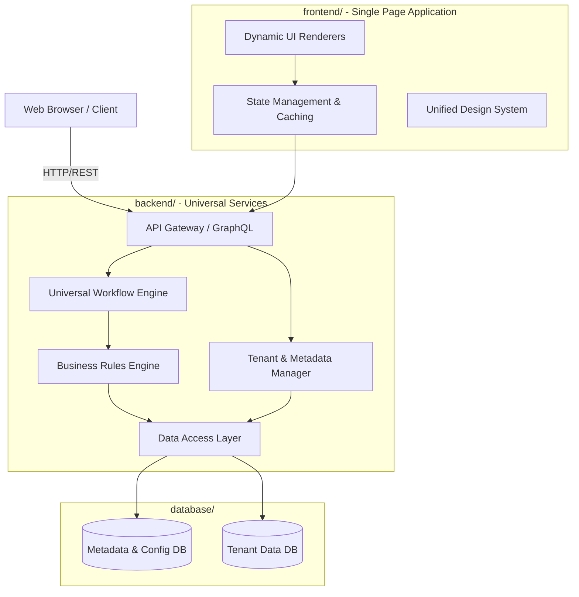
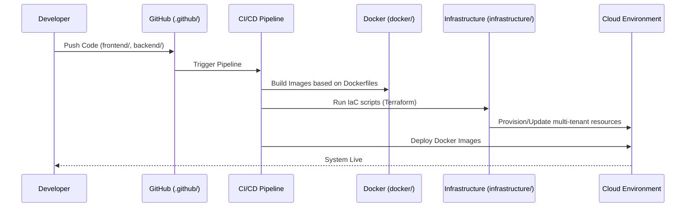
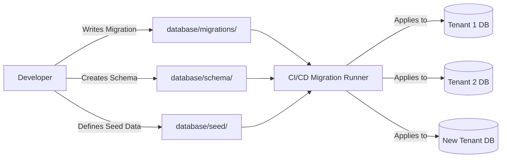

# ToolRoomOS System & Directory Architecture

This document outlines the detailed architecture of the ToolRoomOS repository, explaining the purpose of each directory and the high-level workflows that connect them. It adheres to the core product philosophy of being a Generic, Configurable, Multi-Tenant Enterprise Manufacturing Operating System.

## Directory Structure & Purpose

- **`backend/`**: The core server-side application logic, APIs, and business services. Houses universal engines (workflow, rules), multi-tenant metadata controllers, domain logic, and data access layers.
- **`frontend/`**: The client-side web application source code. Implements a unified design system and dynamic UI renderers that interpret metadata to generate screens without tenant-specific code.
- **`database/`**: SQL/NoSQL schema definitions, incremental migration scripts (`migrations/`), and configuration seed data (`seed/`) required to bootstrap the platform.
- **`docs/`**: Comprehensive project documentation including Architecture Decision Records (`adr/`), API specs, PRDs, UI guidelines, and business calculations.
- **`docker/`**: Containerization configurations (`Dockerfile`, `docker-compose.yml`) for reproducible local development and CI/CD.
- **`infrastructure/`**: Infrastructure as Code (Terraform, Pulumi) for provisioning secure, enterprise-ready cloud resources.
- **`samples/`**: Dummy data and assets (drawings, excel templates, pdfs) used for testing without exposing real customer data.
- **`scripts/`**: Automation utilities for environment setup, mock data generation, and deployment tasks.

---

## System Architecture Workflow

The following diagram illustrates how the components stored in these directories interact at runtime in the Enterprise System.

---

## Development & Deployment Workflow

This diagram shows how the infrastructure, docker, and scripts folders facilitate the development and deployment lifecycle, ensuring that the system is scalable and isolated.

---

## Data Migration & Seeding Workflow

This diagram illustrates how database schemas and seed data are applied securely across multiple tenants, guaranteeing that tenant environments remain up to date without manual database intervention.

